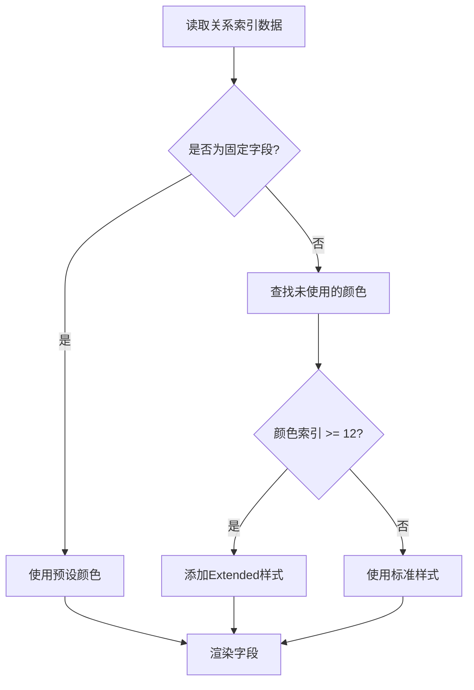

# 关系索引颜色方案 - 快速参考指南

## 🎨 12色颜色池速查表

| # | 颜色名 | 十六进制 | 预览 | 固定字段 | 语义 |
|---|--------|---------|------|---------|------|
| 1 | 琥珀金 | `#f59e0b` | 🟡 | 一把手 | 最高权力 |
| 2 | 紫罗兰 | `#a855f7` | 🟣 | 直接上级 | 直接领导 |
| 3 | 鲜红色 | `#ef4444` | 🔴 | 政治宿敌列表 | 敌对关系 |
| 4 | 玫瑰粉 | `#ec4899` | 💗 | 配偶 | 情感关系 |
| 5 | 玫红色 | `#f43f5e` | ❤️ | 绯色对象列表 | 浪漫关系 |
| 6 | 宝石蓝 | `#3b82f6` | 🔵 | 竞争对手列表 | 竞争关系 |
| 7 | 青绿色 | `#06b6d4` | 🩵 | 靠山列表 | 支持关系 |
| 8 | 翡翠绿 | `#10b981` | 💚 | 核心嫡系列表 | 核心团队 |
| 9 | 活力橙 | `#f97316` | [object Object] | 其他关系 |
| 10 | 黄绿色 | `#84cc16` | [object Object] | 其他关系 |
| 11 | 靛蓝色 | `#6366f1` | 🔷 | - | 其他关系 |
| 12 | 青碧色 | `#14b8a6` | 🩵 | - | 其他关系 |

## 🔧 使用方法

### 1. 固定字段（自动分配）
```typescript
// 这些字段会自动使用预设颜色
一把手 → 琥珀金
直接上级 → 紫罗兰
配偶 → 玫瑰粉
政治宿敌列表 → 鲜红色
绯色对象列表 → 玫红色
竞争对手列表 → 宝石蓝
靠山列表 → 青绿色
核心嫡系列表 → 翡翠绿
```

### 2. 动态字段（智能分配）
- LLM新增的字段会自动使用未被占用的颜色
- 颜色按顺序分配：9 → 10 → 11 → 12 → 13 → ...
- 第13个及以后的字段会添加边框和降低透明度

### 3. Extended字段（第13+）
```scss
// 自动添加的样式
border: 1px solid var(--field-color);
opacity: 0.85;
```

## 📊 颜色分组

### 层级类（暖色）
- 🟡 琥珀金 - 最高层级
- 🟣 紫罗兰 - 中层领导

### 情感类（红粉）
- 🔴 鲜红色 - 敌对
- 💗 玫瑰粉 - 配偶
- ❤️ 玫红色 - 浪漫

### 技术类（冷色）
- 🔵 宝石蓝 - 竞争
- 🩵 青绿色 - 支持
- 💚 翡翠绿 - 团队

### 中性类（混合）
- 🟠 活力橙 - 其他
- 💛 黄绿色 - 其他
- 🔷 靛蓝色 - 其他
- 🩵 青碧色 - 其他

## 🎯 设计原则

### 对比度标准
- ✅ 所有颜色对比度 > 4.5:1（WCAG AA）
- ✅ 色相差异 ≥ 60度（或明度差异 ≥ 10%）
- ✅ 饱和度 65-80%
- ✅ 明度 45-60%

### 色盲友好
- ✅ 红绿色盲：通过明度和蓝色系区分
- ✅ 蓝黄色盲：通过明度和红色系区分
- ✅ 全色盲：明度范围39%-67%

##[object Object]颜色分配流程



## 📝 代码示例

### 添加新的固定字段
```typescript
const FIXED_FIELD_COLORS: Record<string, number> = {
  // 现有字段...
  '新字段名': 9, // 使用第9个颜色（活力橙）
};
```

### 修改颜色池
```typescript
const FIELD_COLORS = [
  '#f59e0b', // 1. 琥珀金
  // ... 其他颜色
  '#your_color', // 添加新颜色
];
```

## 🐛 常见问题

### Q: 为什么有些字段有边框？
A: 第13个及以后的字段会自动添加边框，用于与前12个字段区分。

### Q: 如何确保某个字段使用特定颜色？
A: 在 `FIXED_FIELD_COLORS` 中添加映射关系。

### Q: 颜色不够用怎么办？
A: 系统会自动循环使用前12个颜色的深色版本，并添加边框区分。

### Q: 如何测试颜色效果？
A: 在深色背景下查看，确保对比度 > 4.5:1。

## 📈 性能指标

- 颜色计算：< 1ms
- 渲染时间：< 5ms
- 内存占用：< 1KB
- 响应速度：实时

## 🎨 视觉效果

### 标准字段
```
[琥珀金标签] [紫罗兰标签] [鲜红色标签]
```

### Extended字段
```
[琥珀金标签+边框] [紫罗兰标签+边框]
```

### Hover效果
```
[标签] → [标签↑ + 背景高亮]
```

## 📚 相关文档

- [关系索引颜色设计方案.md](./关系索引颜色设计方案.md) - 完整设计文档
- [颜色对比度测试报告.md](./颜色对比度测试报告.md) - 测试报告
- [关系索引面板重写说明.md](./关系索引面板重写说明.md) - 实现说明

## ✅ 检查清单

部署前请确认：
- [ ] 所有颜色对比度 > 4.5:1
- [ ] 固定字段颜色映射正确
- [ ] Extended字段样式正常
- [ ] Hover效果流畅
- [ ] 响应式更新正常
- [ ] 色盲模式测试通过

